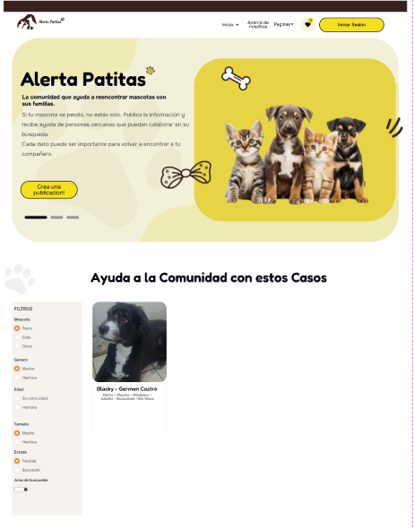
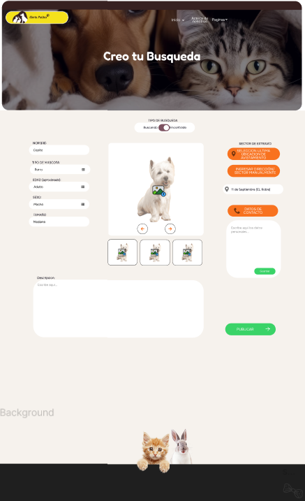

# Alerta Patitas - Version React

Este repositorio contiene el código fuente, las configuraciones y los recursos gráficos que componen la migración de la plataforma Alerta Patitas desde un sitio estructurado en HTML y JavaScript hacia una arquitectura modular basada en React y Vite, con integración de Supabase como Backend as a Service.

---

## Resumen de Componentes Incorporados en Git

El código fuente de este repositorio integra de forma completa los siguientes módulos y requerimientos funcionales del sistema:

* **F01: Gestión de Cuentas**
  Incorpora los componentes de autenticación para el registro de usuarios, inicio de sesión seguro y procesos de recuperación de contraseña, garantizando el control de acceso y la autoría confidencial de los reportes.

* **F02: Publicación de Reportes**
  Contiene los formularios estructurados y validados para la captura de datos críticos de las mascotas (estado, descripción y características básicas).

* **F03: Motor de Búsqueda Avanzado**
  Implementa la lógica de filtrado dinámico en el cliente para clasificar avisos por categorías (Perdido/Encontrado), delimitación geográfica focalizada en la comuna de Arica y rangos temporales específicos.

* **F04: Panel de Administración**
  Módulos internos dedicados a la moderación de contenido por parte de perfiles administradores, permitiendo la eliminación de registros duplicados o denunciados, y la gestión de la distribución de publicidad no invasiva.

---

## Diseño UI/UX e Integración con Figma

La estructura visual y la navegación desarrolladas en el código de este repositorio corresponden estrictamente al diseño e ingeniería de interfaz planificados en Figma. 

El proyecto de diseño detallado se encuentra disponible en el siguiente enlace oficial:
* Enlace al proyecto en Figma: https://www.figma.com/design/yYHQuBHclo9Xzv5OayxkaA/Alerta-Patitas?t=i37GJj7adC1X8Toj-0

Las imágenes adjuntas en el directorio `readme-descripcion/` representan las vistas oficiales diseñadas en Figma que guían la construcción de los componentes en React:

| Vista Home (Diseño Figma) | Iniciar Sesión (Diseño Figma) |
| :---: | :---: |
|  |  |

| Editor de Reportes (Diseño Figma) | Arquitectura de Repositorio (Diseño Figma) |
| :---: | :---: |
|  |  |

---

## Stack Tecnológico del Repositorio

* **Capa de Frontend:** React (con Vite como empaquetador y entorno de ejecución de desarrollo rápido).
* **Capa de Servidor y Persistencia:** Supabase (utilizado para persistencia en PostgreSQL, manejo de sesiones de usuario mediante Auth y almacenamiento de archivos).

---

## Instrucciones de Instalación y Despliegue Local

Para levantar el entorno local con los componentes incluidos en este Git, ejecute la siguiente secuencia de comandos en su terminal:

### 1. Instalación de dependencias
```bash
npm install